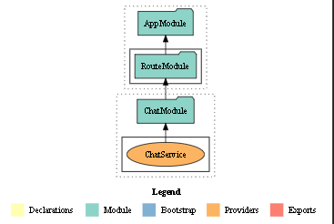
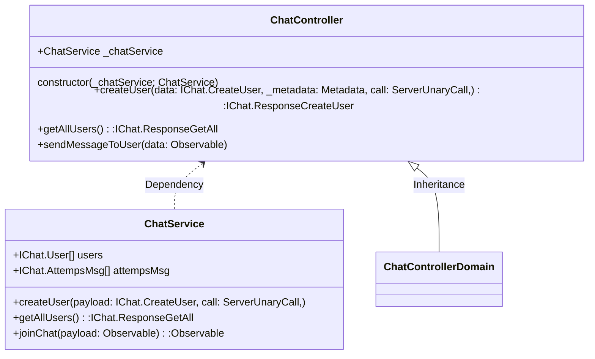

# Configuration
- **Port**: 50051
- **Proto files**:
  - /proto/chat.proto
- **Transport**: gRPC
- **PRD**: [](https://dev.azure.com/gabrieljoseDev77/dev/_build/latest?branchName=main)
- **DEV**: [](https://dev.azure.com/gabrieljoseDev77/dev/_build/latest?definitionId=11&branchName=develop)

# Micro Service information
- **Endpoints**
  - **CreateUser**
    - **Interface**: IChat.CreateUser
    - **Stream**: No
    - **Body**:
    ```json
    {
      "user": "gb"
    }
    ```
    - **Response**:
    ```json
    {
      "error": "",
      "userCreated": true
    }
    ```
  - **GetAllUsers**
    - **Interface**: N/A
    - **Stream**: No
    - **Body**: No
    - **Response**:
    ```json
    {
      "users": [
          {
              "id": 1,
              "user": "gb"
          },
          {
              "id": 2,
              "user": "gbOutroUsuario"
          }
      ]
    }
    ```
  - **SendMessageToUser**
    - **Interface**: IChat.SendToUser
    - **Stream**: yes
      - **Bidirecional**: yes
    - **Body**:
    ```json
    {
      "from": "gb",
      "toID": 2,
      "msg": "Olá amigo!"
    }
    ```
